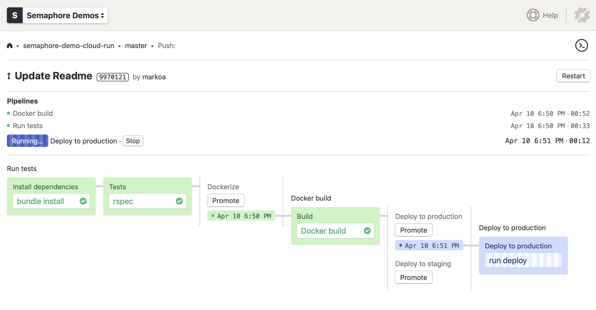

# Semaphore CI/CD demo for Google Cloud Run

[](https://semaphore-demos.semaphoreci.com/projects/semaphore-demo-cloud-run)

This is an example application and CI/CD pipeline showing how to build, test and
deploy a serverless microservice to Google Cloud Run using Semaphore.

Ingredients:

- Ruby Sinatra as web framework
- RSpec for tests
- Packaged in a Docker container
- Container pushed to Google Container Registry
- Deployed to Google Cloud Run:
    - One-click deployment to staging
    - Continuous deployment to master on green builds on master branch

## CI/CD on Semaphore

If you're new to Semaphore, feel free to fork this repository and use it to
[create a project](https://docs.semaphoreci.com/article/63-your-first-project).

The CI/CD pipeline is defined in `.semaphore` directory and looks like this:



You can [follow through the documentation][docs] for a complete walkthrough.

## Local application setup

To run the microservice:

```bash
bundle install
bundle exec rackup
```

To run tests:

```bash
bundle exec rspec
```

To build and run Docker container:

```bash
docker build -t semaphore-demo-ruby-app .
docker run -itd -p 8080:8080 semaphore-demo-ruby-app
curl localhost:8080
> hello world :))
```

## License

Copyright (c) 2021 Rendered Text

Distributed under the MIT License. See the file LICENSE.

[docs]: https://docs.semaphoreci.com/article/128-google-cloud-run-cicd
